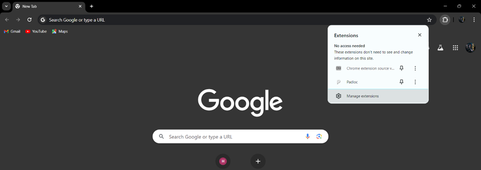
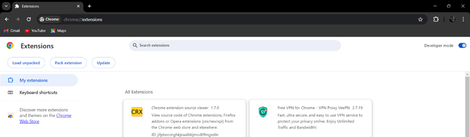
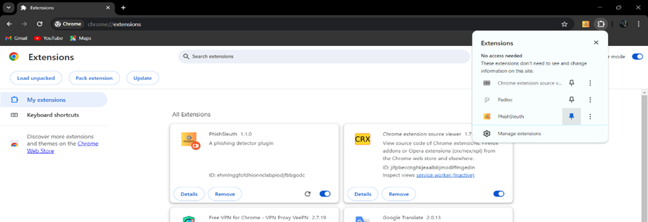
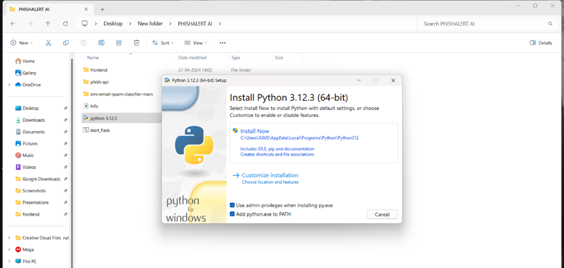
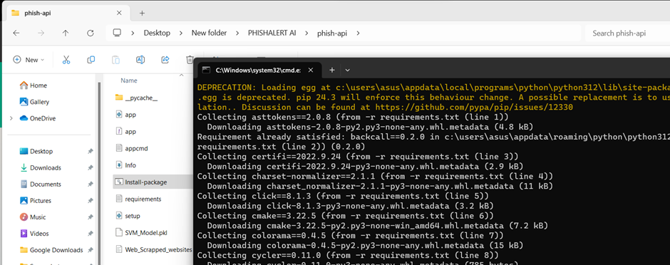
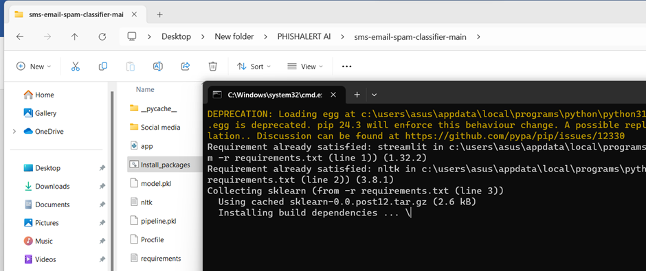
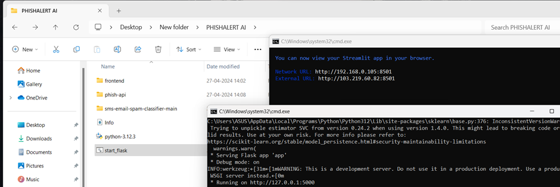
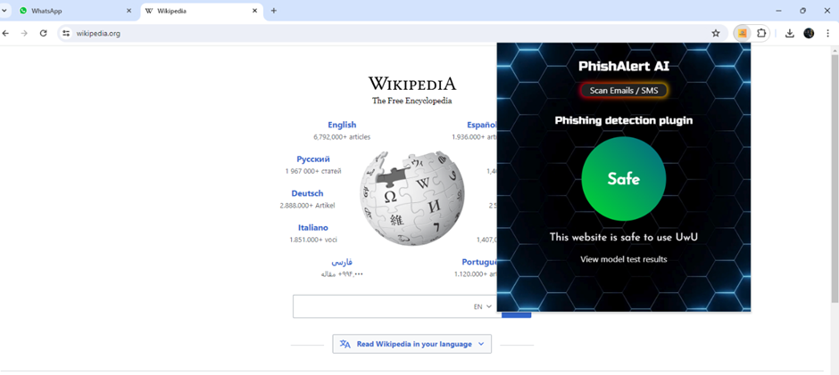
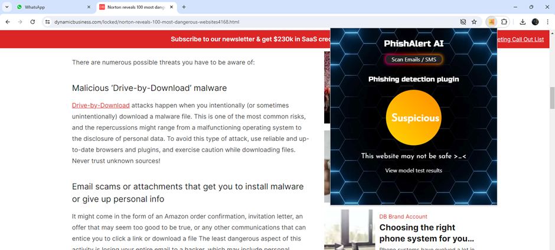
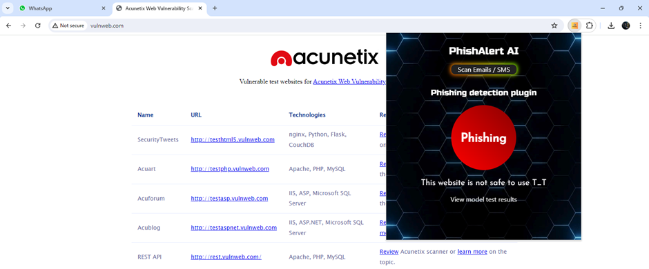

# PHISHALERT-AI-Detecting-Phishing-Domains-with-AI/ML

PhishAlert-AI is an advanced phishing detection tool designed to identify and prevent phishing attacks. It includes a Chrome extension and backend services for enhanced security.

## Features
- AI-powered phishing domain detection.
- Chrome extension for real-time analysis.
- Backend Flask API for data processing.
- SMS and email spam classification.

## Installation and Usage

### Step 1: Load the Chrome Extension
1. Open Google Chrome.
2. Access the Chrome menu by clicking the three dots at the top-right corner.
3. Navigate to **More tools** > **Extensions**.

4. Enable **Developer Mode** using the toggle at the top-right corner of the Extensions page.

5. Click the **Load unpacked** button.
6. Navigate to the `frontend` folder in the repository and select it to load the extension.

### Step 2: Install Python
1. Go to the `PHISHALERT AI` folder.
2. Install Python 3.12.3 using the provided setup file.

### Step 3: Install Required Packages
1. Navigate to the `Phish-api` folder and run the `Install_package.bat` file.

2. Go to the `sms-email-spam-classifier-main` folder and run its `Install_package.bat` file.

### Step 4: Start the Flask Server
1. Navigate to the `main` folder.
2. Run the `Start_flask.bat` file.

### Step 5: Use the Tool
1. Open your browser and click on the **PHISHALERT AI** extension.
2. Open any website to check its safety status.

## Contributing
Feel free to fork this repository, make changes, and submit a pull request. Your contributions are welcome!

## License
This project is licensed under the MIT License. See the LICENSE file for details.

